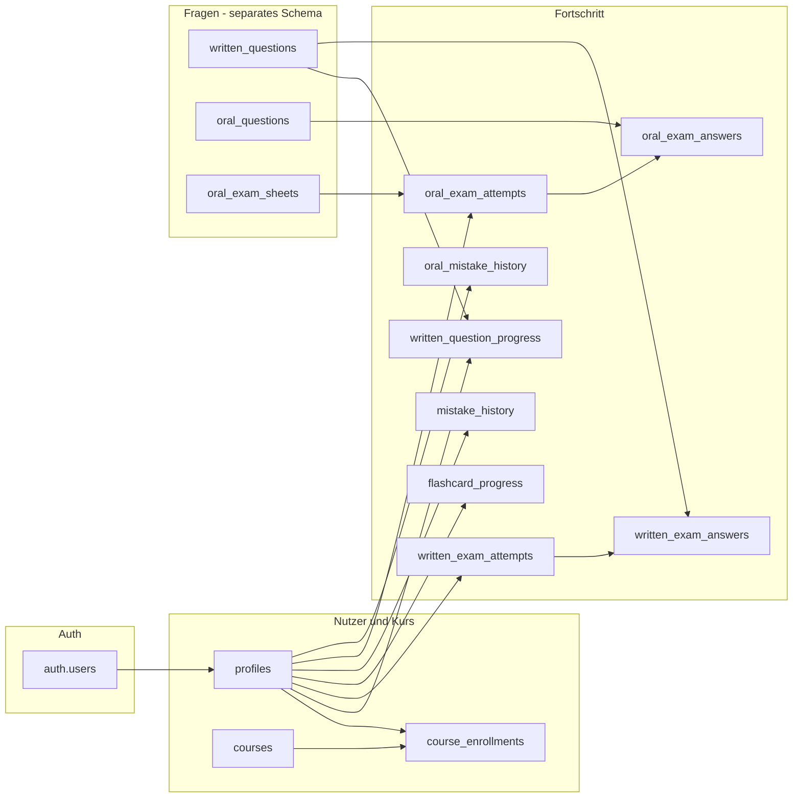

# Accaoui §34a Lern-App – Supabase Nutzer-, Kurs- und Fortschrittsdatenmodell (Planung)

Stand: v23.5.8  
Zweck: Technische Planungsgrundlage für Auth, Profile, Kurse und alle lernbezogenen Nutzerdaten in Supabase.  
Bezug: `docs/CURSOR_MASTER_CONTEXT_ACCAOUI.md`, `docs/QUESTION_DATABASE_PLAN.md`, `docs/SUPABASE_QUESTION_SCHEMA.md`

---

## 1. Zweck des Nutzer- und Fortschrittsmodells

Das Nutzer- und Fortschrittsmodell ergänzt das Fragenmodell (`docs/SUPABASE_QUESTION_SCHEMA.md`) um die **personenbezogene und kursbezogene Ebene** der Accaoui §34a Lern-App.

Konkrete Ziele:

1. **Teilnehmer-Login** – Supabase Auth mit Profil, Rolle und Kurszuordnung.
2. **Fortschritt pro Nutzer** – Lernstand, Prüfungen, Fehler und Lernkarten nicht mehr nur im Browser, sondern zentral und geräteübergreifend.
3. **Kurssteuerung** – Accaoui-Bildungsgänge mit aktivem/inaktivem Zugang und optionaler Laufzeit.
4. **Dozenten- und Admin-Sicht** – Auswertung nur für berechtigte Kurse; keine offenen Nutzerdaten für alle.
5. **Trennung von Inhalten und Verhalten** – Fragentexte in Fragentabellen; Antworten, Bewertungen und Historie in Fortschrittstabellen (keine PII in Fragen).
6. **Vorbereitung App Store / DSGVO** – dokumentierte Datenarten für Datenschutzerklärung und Store-Angaben (Google Play Data Safety, Apple App Privacy).

Dieses Dokument enthält **kein SQL**, keine Supabase-Verbindung und keine Migration aus `localStorage`.

---

## 2. Grundregel: localStorage als Übergang

| Phase | Speicher | Gültigkeit |
|-------|----------|------------|
| **Aktuell (v23)** | `localStorage` im Browser | Nur lokales Gerät; Entwicklung und Demo ohne Login |
| **Ziel (v27+)** | Supabase Postgres pro `user_id` | Geräteübergreifend; an Kurs und Teilnehmerstatus gebunden |

**Verbindliche Regel:**

- `localStorage` ist **nur Übergang** und wird nicht als langfristige Quelle der Wahrheit betrachtet.
- Später werden alle in Master Context §10 genannten Lern- und Prüfungsdaten **pro `user_id`** (und wo sinnvoll **`course_id`**) in Supabase gespeichert.
- Frageninhalte werden **nicht** in Fortschrittstabellen dupliziert – nur Referenzen (`written_question_id` / `public_id`, `oral_question_id`, `sheet_id`).
- Nach Einführung von Auth: sensible oder dauerhafte Daten **nicht** in `localStorage` ablegen (siehe §18).

### Aktuelle localStorage-Keys (Referenz für spätere Migration)

| Key (App) | Geplante Supabase-Tabelle(n) |
|-----------|------------------------------|
| `accaoui_answered_questions` | `written_question_progress` |
| `accaoui_topic_stats` | Aggregat aus `written_question_progress` / Views (optional) |
| `accaoui_topic_mistakes` | `mistake_history` |
| `accaoui_exam_history` | `written_exam_attempts` (+ `written_exam_answers`) |
| `accaoui_flashcard_progress` | `flashcard_progress` |
| Mündliche Keys (z. B. in `oral-exam.js`) | `oral_exam_attempts`, `oral_exam_answers`, `oral_mistake_history` |

---

## 3. Tabellenübersicht

| Tabelle | Zweck | Hauptbeziehungen |
|---------|--------|------------------|
| `profiles` | Nutzerprofil zu `auth.users` (Rolle, Anzeigename, Status) | 1:1 ← `auth.users`; 1:n → Fortschrittstabellen |
| `courses` | Accaoui-Kurs / Bildungsgang (§34a) | 1:n → `course_enrollments` |
| `course_enrollments` | Teilnehmer ↔ Kurs inkl. Teilnehmerstatus | n:1 ← `profiles`, `courses` |
| `written_question_progress` | Einzelne schriftliche Frage: beantwortet, richtig/falsch | n:1 ← `profiles`; Referenz → `written_questions` |
| `written_exam_attempts` | Eine schriftliche Prüfungssimulation / Prüfungslauf | n:1 ← `profiles`, `courses` |
| `written_exam_answers` | Antworten innerhalb eines Prüfungsversuchs | n:1 ← `written_exam_attempts` |
| `flashcard_progress` | Lernkarten-Status pro Frage/Karte | n:1 ← `profiles` |
| `mistake_history` | Schriftliches Fehlertraining (Thema/Frage) | n:1 ← `profiles` |
| `oral_exam_attempts` | Mündliche Simulation (A/B, 15 Min, Training) | n:1 ← `profiles`; Referenz → `oral_exam_sheets` |
| `oral_exam_answers` | Bewertung pro mündlicher Frage im Versuch | n:1 ← `oral_exam_attempts` |
| `oral_mistake_history` | Mündliches Fehlertraining | n:1 ← `profiles` |

**Abgrenzung zum Fragenmodell:** Veröffentlichte Fragen lesen Teilnehmer über RLS aus `written_questions` / `oral_questions` (nur `published`). Fortschrittstabellen speichern **nur Verhalten und Ergebnisse**.

---

## 4. Felder: `profiles`

Erweiterung von Supabase Auth (`auth.users`). Primärschlüssel `id` = `auth.users.id`.

| Feld | Typ (geplant) | Pflicht | Beschreibung |
|------|----------------|---------|--------------|
| `id` | `uuid` | ja | PK, FK → `auth.users.id` |
| `role` | `text` | ja | `participant`, `instructor`, `admin` (App-Anzeige: Teilnehmer, Dozent, Admin) |
| `display_name` | `text` | nein | Anzeigename in der App |
| `email` | `text` | nein | Spiegel aus Auth (optional denormalisiert für Admin-Listen) |
| `participant_status` | `text` | nein | Nur bei Rolle Teilnehmer: siehe §15 |
| `phone` | `text` | nein | Optional, nur wenn fachlich nötig |
| `organization` | `text` | nein | Optional (Accaoui intern) |
| `avatar_url` | `text` | nein | Optional, Supabase Storage |
| `last_active_at` | `timestamptz` | nein | Letzte App-Nutzung |
| `created_at` | `timestamptz` | ja | |
| `updated_at` | `timestamptz` | ja | |
| `deleted_at` | `timestamptz` | nein | Soft-Delete / DSGVO-Löschung vorbereitet |

**Hinweis:** Passwort und OAuth-Tokens verbleiben ausschließlich in Supabase Auth, nicht in `profiles`.

---

## 5. Felder: `courses`

| Feld | Typ (geplant) | Pflicht | Beschreibung |
|------|----------------|---------|--------------|
| `id` | `uuid` | ja | Primärschlüssel |
| `course_code` | `text` | ja | Kurzes Kürzel (unique), z. B. `34a-2026-05` |
| `title` | `text` | ja | Kursbezeichnung |
| `description` | `text` | nein | Beschreibung für Teilnehmer/Admin |
| `starts_at` | `date` | nein | Kursbeginn |
| `ends_at` | `date` | nein | Kursende (für `expired`) |
| `is_active` | `boolean` | ja | Kurs global aktiv |
| `assigned_instructor_id` | `uuid` | nein | FK → `profiles.id` (Dozent-Hauptzuordnung) |
| `max_participants` | `integer` | nein | Optional |
| `settings` | `jsonb` | nein | z. B. erlaubte Module, Prüfungsmodi |
| `created_at` | `timestamptz` | ja | |
| `updated_at` | `timestamptz` | ja | |

---

## 6. Felder: `course_enrollments`

Verknüpft Teilnehmer mit Kurs; steuert Zugang und Sichtbarkeit für Dozenten.

| Feld | Typ (geplant) | Pflicht | Beschreibung |
|------|----------------|---------|--------------|
| `id` | `uuid` | ja | Primärschlüssel |
| `course_id` | `uuid` | ja | FK → `courses.id` |
| `user_id` | `uuid` | ja | FK → `profiles.id` (Teilnehmer) |
| `enrollment_status` | `text` | ja | Siehe §15: `active`, `inactive`, `expired`, `blocked` |
| `enrolled_at` | `timestamptz` | ja | Einschreibung |
| `expires_at` | `timestamptz` | nein | Individuelles Ablaufdatum |
| `blocked_reason` | `text` | nein | Intern (Admin), nicht für Teilnehmer-UI |
| `notes` | `text` | nein | Interne Admin-Notiz |
| `created_at` | `timestamptz` | ja | |
| `updated_at` | `timestamptz` | ja | |

**Constraint (geplant):** `unique (course_id, user_id)`.

**Regel:** App-Zugriff auf Lernmodule nur bei `enrollment_status = active` und gültigem Kurs (`courses.is_active`).

---

## 7. Felder: `written_question_progress`

Fortschritt pro schriftlicher Frage (Modul „Alle Fragen“, Übung, nicht vollständige Prüfung).

| Feld | Typ (geplant) | Pflicht | Beschreibung |
|------|----------------|---------|--------------|
| `id` | `uuid` | ja | Primärschlüssel |
| `user_id` | `uuid` | ja | FK → `profiles.id` |
| `course_id` | `uuid` | nein | FK → `courses.id` (empfohlen) |
| `written_question_id` | `uuid` | ja | FK → `written_questions.id` |
| `public_question_id` | `text` | ja | Denormalisiert: `written_questions.public_id` |
| `topic` | `text` | nein | Kanonisches Sachgebiet (Snapshot) |
| `times_answered` | `integer` | ja | Anzahl Beantwortungen |
| `times_correct` | `integer` | ja | Anzahl richtig |
| `last_answer_correct` | `boolean` | nein | Letzte Antwort |
| `last_answered_at` | `timestamptz` | nein | |
| `created_at` | `timestamptz` | ja | |
| `updated_at` | `timestamptz` | ja | |

**Constraint (geplant):** `unique (user_id, written_question_id)` oder `unique (user_id, course_id, written_question_id)`.

---

## 8. Felder: `written_exam_attempts`

Ein kompletter schriftlicher Prüfungslauf (Simulation, Themenprüfung, Gesamtprüfung).

| Feld | Typ (geplant) | Pflicht | Beschreibung |
|------|----------------|---------|--------------|
| `id` | `uuid` | ja | Primärschlüssel |
| `user_id` | `uuid` | ja | FK → `profiles.id` |
| `course_id` | `uuid` | nein | FK → `courses.id` |
| `exam_mode` | `text` | ja | z. B. `simulation`, `topic`, `full`, `mistake_training` |
| `topic_filter` | `text` | nein | Ein Sachgebiet oder null (gesamt) |
| `question_count` | `integer` | ja | Anzahl Fragen im Lauf |
| `total_points` | `integer` | nein | Erreichte Punkte |
| `max_points` | `integer` | nein | Maximal mögliche Punkte |
| `percent_score` | `numeric(5,2)` | nein | Prozent |
| `passed` | `boolean` | nein | z. B. ≥ 50 % |
| `duration_seconds` | `integer` | nein | Bearbeitungszeit |
| `started_at` | `timestamptz` | ja | |
| `finished_at` | `timestamptz` | nein | null = abgebrochen |
| `client_version` | `text` | nein | App-Version (Support, kein Tracking) |
| `created_at` | `timestamptz` | ja | |

---

## 9. Felder: `written_exam_answers`

Einzelantworten innerhalb eines Prüfungsversuchs.

| Feld | Typ (geplant) | Pflicht | Beschreibung |
|------|----------------|---------|--------------|
| `id` | `uuid` | ja | Primärschlüssel |
| `attempt_id` | `uuid` | ja | FK → `written_exam_attempts.id` |
| `written_question_id` | `uuid` | ja | FK → `written_questions.id` |
| `public_question_id` | `text` | ja | Denormalisiert |
| `position` | `smallint` | nein | Reihenfolge im Prüfungslauf |
| `selected_answers` | `jsonb` | ja | Array gewählter Antwort-IDs (z. B. `["b"]`) |
| `is_correct` | `boolean` | ja | |
| `points_awarded` | `smallint` | nein | 0, 1 oder 2 |
| `answered_at` | `timestamptz` | ja | |
| `created_at` | `timestamptz` | ja | |

**Constraint (geplant):** `unique (attempt_id, written_question_id)`.

---

## 10. Felder: `flashcard_progress`

Lernkarten-Modul: welche Karten bekannt / in Wiederholung.

| Feld | Typ (geplant) | Pflicht | Beschreibung |
|------|----------------|---------|--------------|
| `id` | `uuid` | ja | Primärschlüssel |
| `user_id` | `uuid` | ja | FK → `profiles.id` |
| `course_id` | `uuid` | nein | FK → `courses.id` |
| `written_question_id` | `uuid` | ja | FK → `written_questions.id` |
| `public_question_id` | `text` | ja | Denormalisiert |
| `card_state` | `text` | ja | z. B. `new`, `learning`, `known`, `review` |
| `ease_factor` | `numeric(4,2)` | nein | Optional für Spaced-Repetition |
| `interval_days` | `integer` | nein | Nächstes Intervall |
| `next_review_at` | `timestamptz` | nein | |
| `last_reviewed_at` | `timestamptz` | nein | |
| `review_count` | `integer` | ja | Standard `0` |
| `created_at` | `timestamptz` | ja | |
| `updated_at` | `timestamptz` | ja | |

**Constraint (geplant):** `unique (user_id, written_question_id)`.

---

## 11. Felder: `mistake_history`

Schriftliches Fehlertraining und Themen-Fehlerübersicht.

| Feld | Typ (geplant) | Pflicht | Beschreibung |
|------|----------------|---------|--------------|
| `id` | `uuid` | ja | Primärschlüssel |
| `user_id` | `uuid` | ja | FK → `profiles.id` |
| `course_id` | `uuid` | nein | FK → `courses.id` |
| `written_question_id` | `uuid` | ja | FK → `written_questions.id` |
| `public_question_id` | `text` | ja | Denormalisiert |
| `topic` | `text` | ja | Sachgebiet |
| `mistake_count` | `integer` | ja | Häufigkeit |
| `last_mistake_at` | `timestamptz` | ja | |
| `last_resolved_at` | `timestamptz` | nein | Erfolgreich im Fehlertraining |
| `is_active` | `boolean` | ja | Noch im Fehlerpool |
| `source_attempt_id` | `uuid` | nein | FK → `written_exam_attempts.id` |
| `created_at` | `timestamptz` | ja | |
| `updated_at` | `timestamptz` | ja | |

**Constraint (geplant):** `unique (user_id, written_question_id)` für aktiven Fehler pro Frage.

---

## 12. Felder: `oral_exam_attempts`

Mündliche Prüfung: Simulation A/B, Volltraining, Thementraining.

| Feld | Typ (geplant) | Pflicht | Beschreibung |
|------|----------------|---------|--------------|
| `id` | `uuid` | ja | Primärschlüssel |
| `user_id` | `uuid` | ja | FK → `profiles.id` |
| `course_id` | `uuid` | nein | FK → `courses.id` |
| `oral_exam_sheet_id` | `uuid` | nein | FK → `oral_exam_sheets.id` (Simulation) |
| `sheet_code` | `text` | nein | z. B. `A`, `B` (denormalisiert) |
| `exam_mode` | `text` | ja | z. B. `simulation_a`, `simulation_b`, `topic_training`, `full_training`, `mistake_training` |
| `topic_filter` | `text` | nein | Optional ein Sachgebiet |
| `question_count` | `smallint` | nein | z. B. 15 bei Simulation |
| `secure_count` | `integer` | nein | Bewertung „Sicher“ |
| `practice_count` | `integer` | nein | Bewertung „Noch üben“ |
| `duration_seconds` | `integer` | nein | |
| `started_at` | `timestamptz` | ja | |
| `finished_at` | `timestamptz` | nein | |
| `created_at` | `timestamptz` | ja | |

---

## 13. Felder: `oral_exam_answers`

Bewertung und optional Selbsteinschätzung pro mündlicher Frage im Versuch.

| Feld | Typ (geplant) | Pflicht | Beschreibung |
|------|----------------|---------|--------------|
| `id` | `uuid` | ja | Primärschlüssel |
| `attempt_id` | `uuid` | ja | FK → `oral_exam_attempts.id` |
| `oral_question_id` | `uuid` | ja | FK → `oral_questions.id` |
| `public_question_id` | `text` | ja | Denormalisiert |
| `position` | `smallint` | nein | 1–15 auf Bogen |
| `examiner_role` | `text` | nein | `examiner_1`, `chair`, `examiner_3` |
| `self_rating` | `text` | nein | z. B. `secure`, `practice` |
| `model_answer_viewed` | `boolean` | ja | Musterantwort geöffnet |
| `answered_at` | `timestamptz` | nein | |
| `created_at` | `timestamptz` | ja | |

**Constraint (geplant):** `unique (attempt_id, oral_question_id)`.

---

## 14. Felder: `oral_mistake_history`

Mündliches Fehlertraining (separat von schriftlich).

| Feld | Typ (geplant) | Pflicht | Beschreibung |
|------|----------------|---------|--------------|
| `id` | `uuid` | ja | Primärschlüssel |
| `user_id` | `uuid` | ja | FK → `profiles.id` |
| `course_id` | `uuid` | nein | FK → `courses.id` |
| `oral_question_id` | `uuid` | ja | FK → `oral_questions.id` |
| `public_question_id` | `text` | ja | Denormalisiert |
| `topic` | `text` | ja | Sachgebiet |
| `mistake_count` | `integer` | ja | |
| `last_mistake_at` | `timestamptz` | ja | |
| `last_resolved_at` | `timestamptz` | nein | |
| `is_active` | `boolean` | ja | |
| `source_attempt_id` | `uuid` | nein | FK → `oral_exam_attempts.id` |
| `created_at` | `timestamptz` | ja | |
| `updated_at` | `timestamptz` | ja | |

**Constraint (geplant):** `unique (user_id, oral_question_id)`.

---

## 15. Teilnehmerstatus

Zwei Ebenen: **globales Profil** (`profiles.participant_status`) und **Kurs-Einschreibung** (`course_enrollments.enrollment_status`). Für App-Zugang ist die **Einschreibung** maßgeblich; das Profil kann den Default spiegeln.

| Status | Bedeutung | App-Zugriff | Typisch gesetzt durch |
|--------|-----------|-------------|------------------------|
| `active` | Teilnehmer darf lernen und Prüfungen nutzen | Ja | Admin bei Kursstart |
| `inactive` | Vorübergehend pausiert (z. B. Urlaub) | Nein (Hinweis) | Admin / Dozent |
| `expired` | Kurs- oder Lizenzzeitraum beendet | Nein | System nach `expires_at` / `courses.ends_at` |
| `blocked` | Gesperrt (Regelverstoß, Zahlung, manuell) | Nein | Admin |

**Prüflogik (geplant):**

```txt
Zugang = eingeloggt
  AND profiles.role = participant
  AND EXISTS course_enrollment mit enrollment_status = active
  AND course.is_active = true
  AND (expires_at IS NULL OR expires_at > now())
```

`blocked` und `expired` überschreiben `active` auf Einschreibungsebene.

---

## 16. Rollenmodell

| Rolle | DB-Wert `profiles.role` | Fortschritt | Kurse / Teilnehmer | Fragenbank |
|-------|-------------------------|-------------|-------------------|------------|
| **Teilnehmer** | `participant` | Nur eigene Zeilen (`user_id = auth.uid()`) | Nur eigene `course_enrollments` lesen | Nur `published` Fragen lesen |
| **Dozent** | `instructor` | Lesen: Fortschritt Teilnehmer **nur** in zugewiesenen Kursen | `courses.assigned_instructor_id = self` oder erweiterte Zuordnungstabelle (später) | Reviews schreiben (siehe Fragen-Schema) |
| **Admin** | `admin` | Vollzugriff | Kurse, Einschreibungen, Status verwalten | Import, Freigabe, Archiv |

**JWT / RLS:** Rolle aus `profiles` bei Session-Start laden; Policies prüfen `auth.uid()` und `role`.

**Service Role Key:** nur serverseitig (Export, Migration, Admin-Batch), nie im Frontend.

---

## 17. Row-Level-Security – Grundidee

RLS auf **allen** Tabellen dieses Dokuments aktivieren.

### Teilnehmer (`participant`)

| Tabelle | SELECT | INSERT | UPDATE | DELETE |
|---------|--------|--------|--------|--------|
| `profiles` | eigene Zeile | — | eigene Zeile (begrenzte Felder) | — |
| `courses` | nur Kurse mit aktiver Einschreibung | — | — | — |
| `course_enrollments` | eigene | — | — | — |
| Alle Fortschrittstabellen | `user_id = auth.uid()` | eigene | eigene | eigene (optional eingeschränkt) |

Kein SELECT auf andere `user_id`.

### Dozent (`instructor`)

| Tabelle | Regel |
|---------|--------|
| `profiles` | SELECT Teilnehmer-Profile nur mit gemeinsamer Kurszuordnung |
| `courses` | SELECT/UPDATE nur `assigned_instructor_id = auth.uid()` (oder Policy über Zuordnungstabelle) |
| `course_enrollments` | SELECT für Teilnehmer in eigenen Kursen; UPDATE nur `enrollment_status` → `inactive` (optional), nicht `blocked` |
| Fortschrittstabellen | SELECT wo `course_id` in Dozenten-Kursen |

Kein INSERT/UPDATE auf Fragen-Freigabe (`published`) – das bleibt Admin (Fragen-Schema).

### Admin (`admin`)

- Voller CRUD auf `courses`, `course_enrollments`, alle Fortschrittstabellen (Support/Löschung).
- Kann `enrollment_status` und `blocked_reason` setzen.
- DSGVO-Löschung: Anonymisierung oder Hard-Delete nach Prozess (später dokumentiert in Rechtstexten v26).

### Querbezug Fragen-Schema

- Teilnehmer: `written_questions` / `oral_questions` nur `status = published` (keine Fortschritt-Policy ersetzt Fragen-RLS).
- Fortschritt-FKs dürfen nur auf existierende, für den Nutzer sichtbare Fragen verweisen (App-Validierung + optional DB-Trigger später).

---

## 18. Datenschutzregel

1. **Datenminimierung** – In `profiles` nur Felder, die für Kursbetrieb und Support nötig sind (Name, E-Mail über Auth; kein unnötiges Geburtsdatum, keine vollständigen Adressen ohne Grund).
2. **Keine unnötigen Trackingdaten** – Kein Werbe-Tracking, keine Analytics-IDs in Fortschrittstabellen; `client_version` nur für Fehleranalyse optional.
3. **Keine sensiblen Daten in localStorage** (nach Auth-Einführung) – Keine Tokens, keine vollständigen Prüfungshistorien dauerhaft im Browser; Session über Supabase Auth.
4. **Trennung Lerninhalte / Nutzerverhalten** – Fragentexte ohne personenbezogene Beispiele (Fragen-Schema §17); Fortschritt nur IDs und Bewertungen.
5. **Lösch- und Auskunftsrecht** – Admin-Prozess: Nutzer deaktivieren → Daten exportieren/löschen nach v26-Rechtstexten.
6. **Kein Service Role Key im Frontend** – siehe Master Context §10.
7. **Keine offenen Tabellen** – Default-Deny in RLS; explizite Policies pro Rolle.

---

## 19. App-Store-Regel

Für **v28 (PWA / App Store)** müssen die gespeicherten Datenarten in Datenschutzangaben beschrieben werden. Dieses Schema liefert die Kategorien:

| Datenart | Inhalt | Zweck | Store-Kategorie (Orientierung) |
|----------|--------|--------|--------------------------------|
| Konto | E-Mail, Auth-UID, `display_name` | Login, Identifikation | Account data |
| Lernfortschritt | Antworten, Punkte, Kartenstatus | Personalisierung, Statistik | App activity |
| Prüfungsergebnisse | Versuche, Bestanden/Nicht bestanden | Lernfortschritt, keine Zertifizierung | App activity |
| Fehlerhistorie | Frage-IDs, Themen, Häufigkeit | Fehlertraining | App activity |
| Kurszuordnung | Kurs-ID, Status, Ablauf | Zugangssteuerung | App functionality |
| Optional Avatar | Profilbild-URL | Darstellung | Photos (optional) |

**Nicht geplant / nicht deklarieren:**

- Standort, Kontakte, Finanzdaten, Gesundheitsdaten, Werbe-ID
- Weitergabe an Dritte zu Marketingzwecken

**Pflichttexte in der App (v26, vor Store):**

- Trainingscharakter, keine offizielle IHK-Prüfung
- Verantwortlicher / Impressum
- Datenschutzerklärung mit Supabase als Auftragsverarbeiter (EU-Region prüfen)
- Nutzungsbedingungen

---

## 20. Was in v23.5.8 noch nicht umgesetzt wird

| Nicht umgesetzt | Anmerkung |
|-----------------|-----------|
| SQL / Migrationen | Erst nach Freigabe dieses Schemas |
| Supabase-Projekt, Auth, RLS-Policies | v27 |
| App-Anbindung (`app.js`, Login-UI) | v27 |
| Migration `localStorage` → Supabase | Eigenes Tool/Script, mit Opt-in und Konfliktregeln |
| Edge Functions / Sync | Optional später |
| Rechtstexte, Store-Listing | v26 / v28 |

**Empfohlene Reihenfolge (Roadmap-Referenz):**

1. v27 – Supabase Auth + `profiles` + `course_enrollments` + Basis-RLS  
2. Schriftlicher Fortschritt (`written_question_progress`, `written_exam_*`)  
3. Lernkarten + Fehlertraining  
4. Mündliche Tabellen + Anbindung Oral-Module (v24 Cleanup hilft)  
5. v26 – Datenschutzerklärung mit Tabellen aus §19  
6. v28 – PWA / Store mit Data-Safety-Mapping  

---

## Anhang A – Datenfluss (vereinfacht)



---

## Anhang B – Bezug zu bestehenden Docs

| Thema | Dokument |
|-------|----------|
| App-Ziele, localStorage heute, Supabase später | `docs/CURSOR_MASTER_CONTEXT_ACCAOUI.md` |
| Fragen-Prozess, localStorage-Regel | `docs/QUESTION_DATABASE_PLAN.md` |
| Fragentabellen, Fragen-RLS, Export | `docs/SUPABASE_QUESTION_SCHEMA.md` |
| Schriftliches Fragenformat | `docs/WRITTEN_QUESTION_STANDARD.md` |

Dieses Schema ist die v23.5.8-Ergänzung zum Fragen-Schema und bereitet v27 (Supabase/Login) vor.
